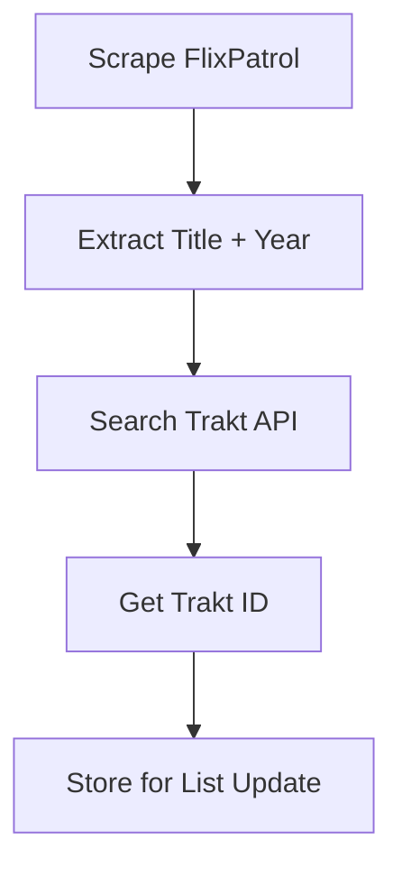
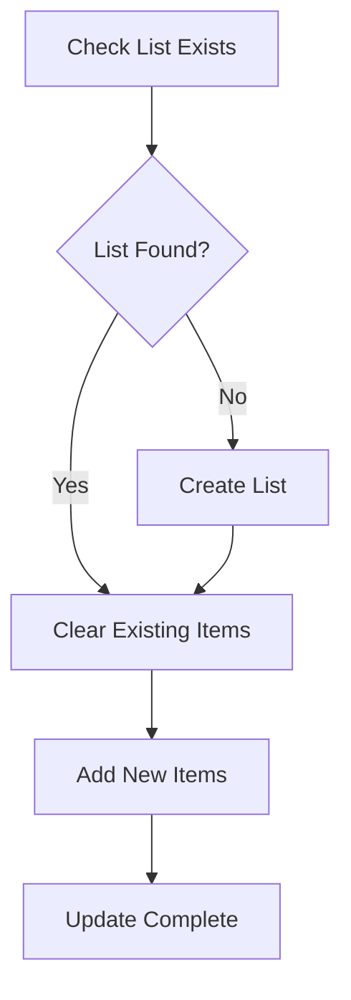

# API Documentation

This document provides comprehensive information about the APIs used by the Top Streaming Services Data Portugal project, including data structures, endpoints, and integration details.

## 📡 Overview

The project integrates with two main APIs:
- **FlixPatrol**: Web scraping for streaming platform rankings (no official API)
- **Trakt.tv**: RESTful API for list management and content identification

## 🎬 FlixPatrol Integration

### Data Source URLs

The project scrapes data from the following FlixPatrol endpoints:

#### Netflix
- **Current Rankings**: `https://flixpatrol.com/top10/netflix/portugal/`
- **Kids Content**: `https://flixpatrol.com/top10/netflix/portugal/{yesterday_date}/`
  - Uses yesterday's date in `YYYY-MM-DD` format
  - Kids content is only available on historical pages

#### HBO Max
- **Current Rankings**: `https://flixpatrol.com/top10/hbo/portugal/`

#### Disney+
- **Current Rankings**: `https://flixpatrol.com/top10/disney/portugal/`
- Note: Disney+ only provides overall rankings (mixed movies and shows)

#### Apple TV+
- **Current Rankings**: `https://flixpatrol.com/top10/apple-tv/portugal/`

#### Amazon Prime Video
- **Current Rankings**: `https://flixpatrol.com/top10/amazon-prime/portugal/`

### Scraping Implementation

#### Request Headers
```python
headers = {
    "Content-Type": "application/json",
    "User-Agent": "Mozilla/5.0 (Macintosh; Intel Mac OS X 10_15_7) AppleWebKit/537.36 (KHTML, like Gecko) Chrome/130.0.0.0 Safari/537.36",
    "Cookie": "_nss=1"
}
```

#### Section Parsing
The scraper looks for specific section titles:
- `"TOP 10 Movies"`
- `"TOP 10 TV Shows"`
- `"TOP 10 Kids Movies"`
- `"TOP 10 Kids TV Shows"`
- `"TOP 10 Overall"` (Disney+ only)

**Robustness Features:**
- Tries multiple heading tags (`h2`, `h3`, `h4`) to find section headers
- Supports case-insensitive matching for section titles
- Falls back to first `<td>` if specific classes not found
- Comprehensive error handling and logging for each parsing step

#### Data Structure
```python
# Scraped data format
[
    (rank, title, title_tag),
    ("1", "Movie Title", "movie-title-slug"),
    ("2", "Another Movie", "another-movie-slug"),
    # ... up to 10 items
]
```

#### HTML Structure
The scraper supports various HTML structures:
```html
<!-- Example 1: With h3 heading -->
<h3>TOP 10 Movies</h3>
<div class="card">
    <tbody>
        <tr>
            <td class="table-td w-12 font-semibold text-right text-gray-500 table-hover:text-gray-400">1</td>
            <td><a href="/title/movie-slug">Movie Title</a></td>
        </tr>
    </tbody>
</div>

<!-- Example 2: With h2 heading and table wrapper -->
<h2>TOP 10 Movies</h2>
<div class="card">
    <table>
        <tbody>
            <tr>
                <td class="rank-cell">1</td>
                <td><a href="/title/movie-slug">Movie Title</a></td>
            </tr>
        </tbody>
    </table>
</div>
```

## 🎯 Trakt.tv API Integration

### Authentication

#### OAuth 2.0 Flow
The project uses OAuth 2.0 for Trakt API authentication:

```python
# Token refresh endpoint
POST https://api.trakt.tv/oauth/token

# Request body
{
    "refresh_token": "refresh_token_value",
    "client_id": "client_id_value", 
    "client_secret": "client_secret_value",
    "redirect_uri": "urn:ietf:wg:oauth:2.0:oob",
    "grant_type": "refresh_token"
}

# Response
{
    "access_token": "new_access_token",
    "token_type": "Bearer",
    "expires_in": 7776000,
    "refresh_token": "new_refresh_token",
    "scope": "public"
}
```

#### Request Headers
```python
headers = {
    'Content-Type': 'application/json',
    'Authorization': f'Bearer {ACCESS_TOKEN}',
    'trakt-api-version': '2',
    'trakt-api-key': CLIENT_ID,
    'User-Agent': "Mozilla/5.0 (Macintosh; Intel Mac OS X 10_15_7) AppleWebKit/537.36 (KHTML, like Gecko) Chrome/130.0.0.0 Safari/537.36"
}
```

### Core Endpoints

#### 1. Token Validation
```http
GET https://api.trakt.tv/users/settings
```
- **Purpose**: Validate current access token
- **Response**: User settings if token is valid, 401 if invalid

#### 2. Content Search
```http
GET https://api.trakt.tv/search/movie?query={title}&year={year}
GET https://api.trakt.tv/search/show?query={title}&year={year}
```
- **Purpose**: Find Trakt IDs for movies/shows
- **Parameters**:
  - `query`: Movie/show title (URL encoded)
  - `year`: Release year (optional, for disambiguation)

**Response Example**:
```json
[
    {
        "type": "movie",
        "score": 100.0,
        "movie": {
            "title": "Movie Title",
            "year": 2023,
            "ids": {
                "trakt": 12345,
                "slug": "movie-title-2023",
                "imdb": "tt1234567",
                "tmdb": 67890
            }
        }
    }
]
```

#### 3. List Management

##### Get User Lists
```http
GET https://api.trakt.tv/users/me/lists
```

##### Create List
```http
POST https://api.trakt.tv/users/me/lists
```
**Request Body**:
```json
{
    "name": "Top Portugal Netflix Movies",
    "description": "List that contains the top 10 movies on Netflix Portugal right now, updated daily",
    "privacy": "public",
    "display_numbers": true
}
```

##### Update List Items
```http
POST https://api.trakt.tv/users/me/lists/{slug}/items
```
**Request Body**:
```json
{
    "movies": [
        {"ids": {"trakt": 12345}},
        {"ids": {"trakt": 67890}}
    ],
    "shows": [
        {"ids": {"trakt": 11111}},
        {"ids": {"trakt": 22222}}
    ]
}
```

##### Remove All Items
```http
POST https://api.trakt.tv/users/me/lists/{slug}/items/remove
```
**Request Body**:
```json
{
    "movies": [{"ids": {"trakt": 0}}],
    "shows": [{"ids": {"trakt": 0}}]
}
```

### Rate Limiting

Trakt API implements rate limiting:
- **Limit**: 1000 requests per 5-minute window
- **Headers**: Response includes rate limit headers
- **Handling**: Project implements retry logic with exponential backoff

```python
@retry_request
def api_call():
    # Implementation includes automatic retry on rate limit (429) responses
    pass
```

## 🔄 Data Flow

### 1. Content Discovery


### 2. List Synchronization


### Data Transformation

#### FlixPatrol → Trakt Mapping
```python
# Input from FlixPatrol
flixpatrol_item = ("1", "Inception", "inception-2010")

# Search Trakt
search_result = search_trakt_api("Inception", 2010)

# Extract Trakt ID  
trakt_id = search_result[0]["movie"]["ids"]["trakt"]

# Create payload
payload = {
    "movies": [{"ids": {"trakt": trakt_id}}]
}
```

## 🛠️ Implementation Details

### Error Handling

#### Network Errors
```python
try:
    response = requests.get(url, headers=headers)
    response.raise_for_status()
except requests.exceptions.RequestException as e:
    logging.error(f"Network error: {e}")
    return None
```

#### API Errors
```python
if response.status_code == 401:
    logging.error("Authentication failed - check tokens")
elif response.status_code == 429:
    logging.warning("Rate limited - retrying after delay")
elif response.status_code >= 500:
    logging.error("Server error - retrying")
```

### Retry Logic
```python
def retry_request(func):
    """Decorator for retrying API requests with exponential backoff"""
    @wraps(func)
    def wrapper(*args, **kwargs):
        for attempt in range(3):
            try:
                result = func(*args, **kwargs)
                if result.status_code < 500:
                    return result
            except Exception as e:
                if attempt == 2:  # Last attempt
                    raise e
                time.sleep(2 ** attempt)  # Exponential backoff
        return None
    return wrapper
```

### Content Matching Logic

#### Title Normalization
```python
def normalize_title(title):
    """Normalize titles for better matching"""
    # Remove common variations
    title = re.sub(r'\s*\([^)]*\)', '', title)  # Remove parentheses
    title = re.sub(r'\s*:\s*', ' ', title)      # Normalize colons
    return title.strip()
```

#### Year Extraction
```python
def extract_year(title_tag):
    """Extract year from FlixPatrol title tag"""
    year_match = re.search(r'-(\d{4})(?:-|$)', title_tag)
    return int(year_match.group(1)) if year_match else None
```

## 📊 List Configurations

### Trakt List Definitions
```python
# Netflix Lists
NETFLIX_LISTS = {
    "movies": {
        "name": "Top Portugal Netflix Movies",
        "slug": "top-portugal-netflix-movies",
        "description": "Top 10 movies on Netflix Portugal, updated daily"
    },
    "shows": {
        "name": "Top Portugal Netflix Shows", 
        "slug": "top-portugal-netflix-shows",
        "description": "Top 10 TV shows on Netflix Portugal, updated daily"
    }
}

# Similar structures for HBO, Disney+, Apple TV+, Prime Video
```

### List Update Strategy
1. **Atomic Updates**: Clear existing items before adding new ones
2. **Ranking Preservation**: Items are added in ranked order
3. **Error Recovery**: Failed updates don't leave lists in partial state
4. **Logging**: Comprehensive logging for debugging and monitoring

## 🔍 Debugging and Monitoring

### Debug Mode
```bash
# Enable debug output
PRINT_LISTS=True python top_pt_stream_services.py
```

### API Response Logging
```python
# Log API responses for debugging
logging.debug(f"Trakt search response: {response.json()}")
logging.debug(f"List update payload: {payload}")
```

### Health Checks
```python
# Validate token before processing
token_status = check_token()
if not token_status:
    logging.error("Invalid token - exiting")
    return -1
```

## 🚨 Error Codes

### Common HTTP Status Codes
- `200`: Success
- `201`: Created (successful list creation)
- `401`: Unauthorized (invalid token)
- `404`: Not found (list or content not found)
- `429`: Too Many Requests (rate limited)
- `500`: Internal Server Error (API issue)

### Custom Return Codes
- `0`: Success
- `-1`: Authentication failure
- `304`: No changes needed (empty payload)

---

This API documentation provides the foundation for understanding and extending the Top Streaming Services Data Portugal project. For additional details, refer to the [Trakt API documentation](https://trakt.docs.apiary.io/) and examine the source code.