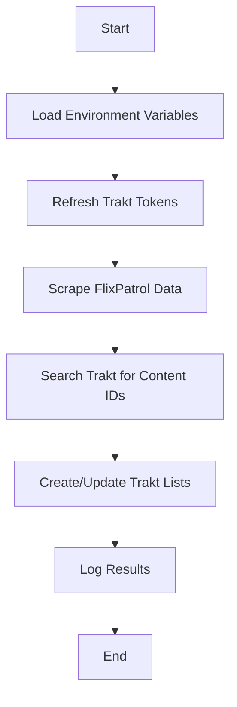

# Top Streaming Services Data Portugal 🇵🇹

[](https://github.com/pcarrasqueira/top-streaming-services-data-portugal/actions)
[](https://www.python.org/downloads/)

A comprehensive Python automation tool that tracks the most popular content across major streaming platforms in Portugal. This project scrapes real-time data from [FlixPatrol](https://flixpatrol.com/) and automatically syncs curated top 10 lists to [Trakt.tv](https://trakt.tv/), providing an always up-to-date view of trending movies and TV shows.

## 🎯 Overview

Stay connected with Portugal's streaming trends! This automation tool:

- 📊 **Tracks Multiple Platforms**: Netflix, HBO Max, Disney+, Apple TV+, and Amazon Prime Video
- 🔄 **Auto-Sync to Trakt**: Creates and maintains public Trakt lists with trending content
- ⏰ **Real-Time Updates**: Runs 4 times daily via GitHub Actions (00:00, 08:00, 12:00, 17:00 UTC)
- 🎬 **Comprehensive Coverage**: Movies, TV shows, and optional kids content
- 🔒 **Secure**: Uses OAuth token refresh for reliable Trakt API access

## ✨ Features

### Core Functionality
- **Multi-Platform Scraping**: Automatically extracts top 10 content from major streaming services
- **Intelligent Content Matching**: Uses Trakt's search API to accurately identify movies and shows
- **Dynamic List Management**: Creates, updates, and maintains Trakt lists with proper rankings
- **Error Handling**: Robust retry mechanisms and comprehensive logging
- **Token Management**: Automatic OAuth token refresh for uninterrupted operation

### Supported Streaming Services
- 🔴 **Netflix**: Movies, TV Shows, Kids Movies, Kids TV Shows
- 🟣 **HBO Max**: Movies, TV Shows  
- 🔵 **Disney+**: Overall top content (mixed movies and shows)
- 🍎 **Apple TV+**: Movies, TV Shows
- 📦 **Amazon Prime Video**: Movies, TV Shows

### Generated Trakt Lists
All lists are public and automatically updated with current rankings:
- Top Portugal Netflix Movies
- Top Portugal Netflix Shows  
- Top Portugal Netflix Kids Movies (optional)
- Top Portugal Netflix Kids Shows (optional)
- Top Portugal HBO Movies
- Top Portugal HBO Shows
- Top Portugal Disney+ (mixed content)
- Top Portugal Apple TV Movies
- Top Portugal Apple TV Shows
- Top Portugal Amazon Prime Movies
- Top Portugal Amazon Prime Shows

## 🚀 Quick Start

**For detailed setup instructions, see the [📚 Setup Guide](SETUP.md)**

### Prerequisites

- **Python 3.13+** (or 3.x compatible)
- **Trakt.tv Account** with API application registered
- **GitHub Account** (for automated execution via Actions)

### Installation

1. **Clone the repository**
   ```bash
   git clone https://github.com/pcarrasqueira/top-streaming-services-data-portugal.git
   cd top-streaming-services-data-portugal
   ```

2. **Install dependencies**
   ```bash
   pip install -r requirements.txt
   ```

3. **Set up Trakt API credentials** (see [Configuration](#-configuration) section or [Setup Guide](SETUP.md))

4. **Run the script**
   ```bash
   python top_pt_stream_services.py
   ```

## ⚙️ Configuration

### Environment Variables

Create a `.env` file in the project root with the following variables:

```env
# Trakt API Credentials (Required)
CLIENT_ID=your_trakt_client_id
ACCESS_TOKEN=your_trakt_access_token
REFRESH_TOKEN=your_trakt_refresh_token
CLIENT_SECRET=your_trakt_client_secret

# Optional Settings
KIDS_LIST=True          # Include Netflix kids content (default: False)
PRINT_LISTS=False       # Print scraped lists to console (default: False)
```

### Trakt API Setup

1. **Create a Trakt Application**
   - Go to [Trakt API Settings](https://trakt.tv/oauth/applications)
   - Click "New Application"
   - Fill in the required information:
     - Name: Your application name
     - Redirect URI: `urn:ietf:wg:oauth:2.0:oob`
     - Permissions: Check all required permissions

2. **Get Your Credentials**
   - **Client ID**: Found in your application settings
   - **Client Secret**: Found in your application settings
   - **Access Token & Refresh Token**: Obtain through OAuth flow (see [Trakt API documentation](https://trakt.docs.apiary.io/#introduction/authentication-oauth))

### GitHub Actions Setup (For Automation)

Add the following secrets to your GitHub repository:

- `CLIENT_ID`: Your Trakt client ID
- `CLIENT_SECRET`: Your Trakt client secret  
- `ACCESS_TOKEN`: Your Trakt access token
- `REFRESH_TOKEN`: Your Trakt refresh token
- `GH_PAT`: GitHub Personal Access Token (for secret updates)

Add these variables to your repository:
- `KIDS_LIST`: Set to `true` to include kids content
- `PRINT_LISTS`: Set to `true` to enable console output

## 🔧 Usage

### Manual Execution

Run the script manually for immediate updates:

```bash
# Basic execution
python top_pt_stream_services.py

# With environment variables
CLIENT_ID=your_id ACCESS_TOKEN=your_token python top_pt_stream_services.py

# Enable debug output
PRINT_LISTS=True python top_pt_stream_services.py
```

### Automated Execution

The script runs automatically via GitHub Actions on the following schedule:
- **00:00 UTC** (1:00 AM Portugal Time)
- **08:00 UTC** (9:00 AM Portugal Time)  
- **12:00 UTC** (1:00 PM Portugal Time)
- **17:00 UTC** (6:00 PM Portugal Time)

You can also trigger manual runs:
1. Go to the "Actions" tab in your GitHub repository
2. Select "Get Top PT Stream Services" workflow
3. Click "Run workflow"

## 📋 Requirements

### Python Dependencies
- `requests` - HTTP requests to APIs and web scraping
- `beautifulsoup4` - HTML parsing and content extraction
- `python-dotenv` - Environment variable management

### System Requirements  
- Python 3.13+ (recommended) or 3.x compatible
- Internet connection for API access and web scraping
- GitHub account (for automated execution)

## 🛠️ How It Works

### Architecture Overview

1. **Data Collection**
   - Scrapes FlixPatrol pages for each streaming service
   - Extracts ranked lists of movies and TV shows
   - Handles different page structures (e.g., Disney+ overall rankings)

2. **Content Identification**
   - Searches Trakt.tv API to match scraped titles
   - Resolves ambiguities using release dates and metadata
   - Handles both movies and TV shows appropriately

3. **List Management**
   - Creates Trakt lists if they don't exist
   - Clears existing content before updates
   - Adds new content with proper ranking

4. **Token Management**
   - Automatically refreshes OAuth tokens
   - Updates GitHub secrets for subsequent runs
   - Handles authentication errors gracefully

### Workflow Steps



## 📊 Data Sources

- **FlixPatrol**: Real-time streaming platform rankings
- **Trakt.tv**: Content database and list management
- **GitHub Actions**: Automation and scheduling platform

## 🐛 Troubleshooting

### Common Issues

#### Authentication Errors
```
Error: Invalid access token
```
**Solution**: Check that your Trakt credentials are correct and the access token hasn't expired. The script should auto-refresh tokens, but manual refresh may be needed.

#### Missing Content
```
Warning: Payload is empty. No items to add on list
```
**Solution**: This usually means FlixPatrol structure has changed or the content couldn't be matched on Trakt. Check the logs for specific scraping errors.

#### Rate Limiting
```
Error: Too many requests
```
**Solution**: The script includes retry logic, but if you're hitting rate limits, ensure you're not running multiple instances simultaneously.

### Debug Mode

Enable detailed logging by setting:
```bash
PRINT_LISTS=True python top_pt_stream_services.py
```

### GitHub Actions Issues

1. **Secret Configuration**: Ensure all required secrets are properly set in repository settings
2. **Token Refresh**: Check that `GH_PAT` has permission to update repository secrets
3. **Workflow Permissions**: Verify Actions have necessary permissions in repository settings

## 🤝 Contributing

**For detailed contributing guidelines, see [CONTRIBUTING.md](CONTRIBUTING.md)**

We welcome contributions! Here's how you can help:

### Reporting Issues
- Use GitHub Issues to report bugs or request features
- Provide detailed information including error messages and logs
- Include your Python version and environment details

### Code Contributions

1. **Fork the repository**
2. **Create a feature branch**
   ```bash
   git checkout -b feature/your-feature-name
   ```
3. **Make your changes**
   - Follow existing code style
   - Add comments for complex logic
   - Update documentation if needed
4. **Test your changes**
   ```bash
   python top_pt_stream_services.py
   ```
5. **Commit and push**
   ```bash
   git commit -m "Add your feature description"
   git push origin feature/your-feature-name
   ```
6. **Create a Pull Request**

### Development Guidelines

- **Code Style**: Follow PEP 8 guidelines
- **Error Handling**: Add appropriate try-catch blocks
- **Logging**: Use the existing logging framework
- **Documentation**: Update README and code comments
- **Testing**: Ensure changes don't break existing functionality

## 📚 API Reference

**For comprehensive API documentation, see [API.md](API.md)**

### FlixPatrol Endpoints

The script scrapes data from these FlixPatrol URLs:

- **Netflix**: `https://flixpatrol.com/top10/netflix/portugal/`
- **Netflix Kids**: `https://flixpatrol.com/top10/netflix/portugal/{yesterday_date}/`
- **HBO**: `https://flixpatrol.com/top10/hbo/portugal/`
- **Disney+**: `https://flixpatrol.com/top10/disney/portugal/`
- **Apple TV**: `https://flixpatrol.com/top10/apple-tv/portugal/`
- **Prime Video**: `https://flixpatrol.com/top10/amazon-prime/portugal/`

### Trakt API Endpoints

- **Authentication**: `https://api.trakt.tv/oauth/token`
- **Search**: `https://api.trakt.tv/search/movie` and `https://api.trakt.tv/search/show`
- **Lists**: `https://api.trakt.tv/users/me/lists/`
- **List Items**: `https://api.trakt.tv/users/me/lists/{slug}/items`

### Data Structures

#### Scraped Content Format
```python
[
    (rank, title, title_tag),  # e.g., ("1", "Movie Title", "movie-title-slug")
    ...
]
```

#### Trakt Payload Format
```python
{
    "movies": [
        {"ids": {"trakt": 12345}},
        ...
    ],
    "shows": [
        {"ids": {"trakt": 67890}},
        ...
    ]
}
```

## 📚 Documentation

This project includes comprehensive documentation to help you get started and contribute effectively:

- **[🚀 Setup Guide](SETUP.md)** - Complete step-by-step installation and configuration instructions
- **[📡 API Documentation](API.md)** - Detailed information about FlixPatrol integration and Trakt.tv API usage
- **[🤝 Contributing Guidelines](CONTRIBUTING.md)** - How to contribute to the project, coding standards, and development workflow
- **[📋 Changelog](CHANGELOG.md)** - Project version history, new features, and changes

For quick reference:
- **Installation**: See [SETUP.md](SETUP.md) for detailed setup instructions
- **API Reference**: Check [API.md](API.md) for technical implementation details
- **Contributing**: Read [CONTRIBUTING.md](CONTRIBUTING.md) before submitting pull requests
- **Updates**: Track changes in [CHANGELOG.md](CHANGELOG.md)

## 📞 Support

- **GitHub Issues**: [Create an issue](https://github.com/pcarrasqueira/top-streaming-services-data-portugal/issues)
- **Discussions**: [Join the discussion](https://github.com/pcarrasqueira/top-streaming-services-data-portugal/discussions)
- **Trakt API Docs**: [Official Documentation](https://trakt.docs.apiary.io/)

---

**Last Updated**: 2024
**Maintainer**: [pcarrasqueira](https://github.com/pcarrasqueira)

*This project is not affiliated with FlixPatrol, Trakt.tv, or any streaming service mentioned.*
  
